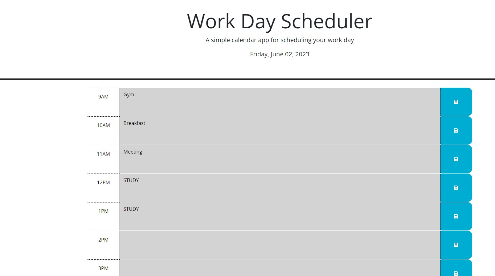

# Calendar Scheduler

## Description

This Calendar Scheduler webpage was created to help the user with organizing a 9 to 5 day. The webpage uses a dynamic function with day.js, as well as jquery and local storage methods to save and overwrite data. The webpage also color codes events based on 'past', 'present', or 'future' status.

## Installation

N/A

## Usage

To use this Calendar Scheduler webpage the user can write text within time blocked rows to put events/tasks they want to remember. Once the task/event is inputted they can simpy click the 'save' button with the disk icon, and the input will be saved within local storage. The input will be kept on the time block row even if the page is refreshed and the time blocks will be color coded in grey for 'past', red for 'current', and green for 'future' events.

[Calendar Scheduler Webpage Link](https://barcar95.github.io/calendar-scheduler/)

## Credits

N/A

## License

Please refer to LICENSE in repo.
